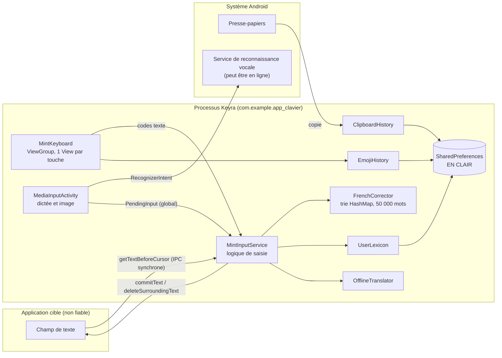
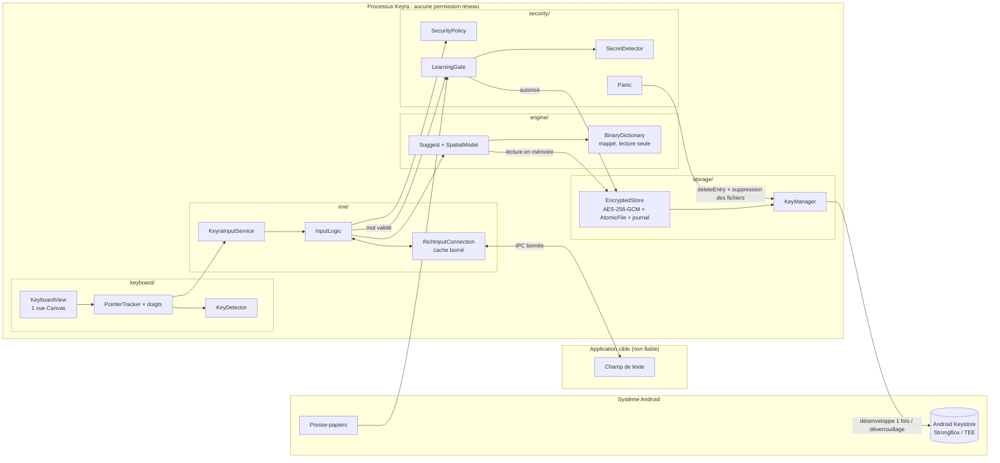
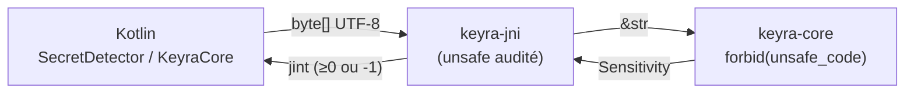

# Architecture — Keyra

> Phase 0. Section 1 : l'existant (11.0). Section 2 : la cible (12.0). Section 3 : où vit le texte en clair.

## 1. Architecture actuelle (11.0)

## 2. Architecture cible (12.0)

### Frontières de confiance

| # | Frontière | Ce qui la traverse | Règle |
|---|-----------|--------------------|-------|
| B1 | Application cible ↔ IME (`InputConnection`, `EditorInfo`) | Texte écrit vers l'application ; texte lu, type de champ et nom de paquet lus depuis elle | Tout ce qui vient de l'application est **non fiable** : tailles bornées, lectures rares, aucune donnée lue n'est apprise sans passer par `LearningGate`. |
| B2 | IME ↔ stockage | Mots, bigrammes, modèle de toucher, presse-papiers, extraits de texte | Uniquement via `EncryptedStore` : chiffré et authentifié. Rien en clair sur disque. |
| B3 | IME ↔ Keystore | Clé de données enveloppée | Une opération par déverrouillage, jamais pendant la frappe. |
| B4 | IME ↔ presse-papiers système | Copies | Lues seulement quand le clavier est visible et l'appareil déverrouillé, puis filtrées par `LearningGate`. |
| B5 | IME ↔ autres applications (intents) | Dictée, sélection d'image, réglages | Aucun texte tapé dans un intent sortant. Les résultats entrants sont liés à la session (`PendingInput`). |
| B6 | Build ↔ dépendances | Code tiers | Zéro dépendance d'exécution, sommes de contrôle vérifiées, manifeste fusionné contrôlé par la CI. |
| B7 | Utilisateur ↔ écran | Surbrillance, aperçu, suggestions | Coupés selon `SecurityPolicy` (pavé PIN, mot de passe, incognito, appareil verrouillé). |

## 3. Où vit le texte en clair, et combien de temps

| Donnée | 11.0 (aujourd'hui) | 12.0 (cible) |
|--------|--------------------|--------------|
| Frappe en cours (code de touche) | chaîne transmise de la vue au service, puis abandonnée au ramasse-miettes | idem, sans copie supplémentaire |
| 80 caractères avant le curseur | relus à **chaque** frappe et à chaque espace (`getTextBeforeCursor`) | cache unique d'environ 1 000 caractères, vidé à `onFinishInput` |
| Dernier mot (`suggestionWord`, `lastCompletedWord`) | jusqu'au prochain champ | idem, vidé à `onFinishInput` |
| Annulation de correction (`undo`) | jusqu'à l'action suivante | idem |
| Touches en attente (`queuedKeys`, 96 maximum) | vidées au changement de session | idem |
| Traduction en attente | jusqu'à 600 caractères, jusqu'au changement de session | idem, puis effacement explicite |
| `PendingInput` (résultat de dictée) | **sans limite de durée**, singleton global | lié à la session, 60 s maximum |
| Mots appris | **disque en clair, sans limite** + mémoire | disque chiffré ; mémoire tant que la clé de données est chargée |
| Historique du presse-papiers | **disque en clair**, 20 éléments sans expiration | chiffré, expiration ; copie sensible en mémoire seulement, 30 s |
| Emoji fréquents | disque en clair | chiffré |
| Coordonnées de toucher du mot en cours | n'existent pas | mémoire seulement, effacées à la fin du mot |
| Mesures de latence (`InputLatency`) | durées seulement | idem |
| Traces Perfetto | noms constants (depuis la phase 0) | idem, vérifié par lint |

## 4. Révision de la phase 1 : Kotlin et Rust

Le cœur pur passe en Rust (ADR-0021). Frontière ajoutée :

| # | Frontière | Ce qui la traverse | Règle |
|---|-----------|--------------------|-------|
| B8 | Kotlin ↔ Rust (`KeyraCore`, JNI) | texte en `byte[]` UTF-8 (16 Kio maximum), entier en retour | `keyra-jni` est le seul code `unsafe` ; tampon effacé des deux côtés ; erreur ⇒ `-1` ⇒ échec fermé côté Kotlin ; `abiVersion` vérifiée au chargement |

